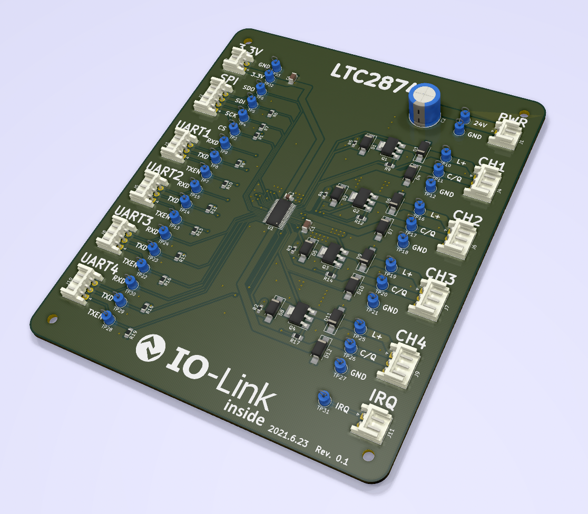

# LTC2874 Breakout board

## 概要

IO-Link のインターフェース IC である LTC2874 を使うための基板です．必要な信号は全てコネクタに取り出してあります．

## 回路図

[LTC2874_Breakout.pdf](LTC2874_Breakout.pdf)

## 実装イメージ

## 必要部品

主な部品は下記になります．

|  種類          | 方式                |
|  ------------ | ------------------- |
|  FQT7N10LTF   | MOSFET              |
|  S100         | ショットキーダイオード  |
|  PTZTFTE2536B | ツェナーダイオード     |

